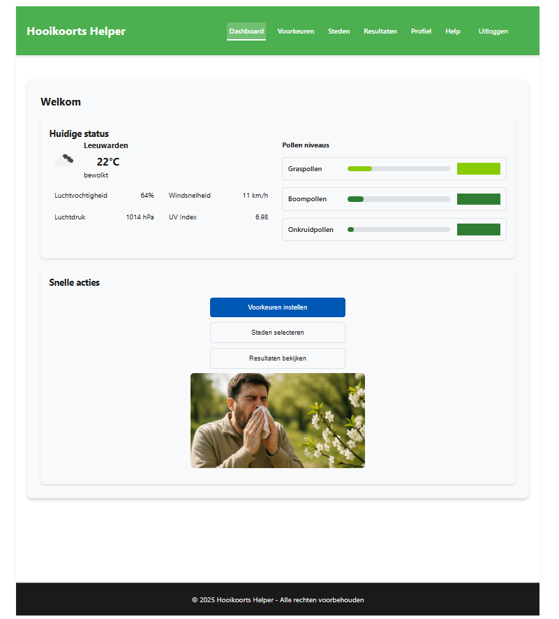

## Inhoudsopgave

- [A. Over deze app](#a-over-deze-app)
- [B. Belangrijkste functies](#b-belangrijkste-functies)
- [C. Technische specificaties & vereisten](#c-technische-specificaties--vereisten)
  - [a. Technische Stack](#a-technische-stack)
  - [b. Systeemvereisten](#b-systeemvereisten)
- [D. Gebruikte API's](#d-gebruikte-apis)
  - [a. API Keys (vereist)](#a-api-keys-vereist)
- [E. Authenticatie en beveiliging](#e-authenticatie-en-beveiliging)
- [F. Server Endpoints en API Proxy](#f-server-endpoints-en-api-proxy)
  - [a. Proxy Server Endpoints](#a-proxy-server-endpoints)
- [G. Externe API-integratie](#g-external-api-integratie)
  - [a. OpenWeather API](#a-openweather-api)
  - [b. Ambee API (via proxy)](#b-ambee-api-via-proxy)
  - [c. NOVI Backend](#c-novi-backend)
- [H. Voorbeeld API Responses](#h-voorbeeld-api-responses)
  - [a. OpenWeather Response](#a-openweather-response)
  - [b. Ambee Pollen Response](#b-ambee-pollen-response)
- [I. Installatie en opstarten](#i-installatie-en-opstarten)
  - [a. Stap-voor-stap installatie](#a-stap-voor-stap-installatie)
  - [b. Environment configuratie](#b-environment-configuratie)
  - [c. Opstartopties](#c-opstartopties)
  - [d. Beschikbare Scripts](#d-beschikbare-scripts)
- [J. Praktische codevoorbeelden](#j-praktische-codevoorbeelden)
  - [a. Basis API calls](#a-basis-api-calls)
  - [b. Context Usage voorbeelden](#b-context-usage-voorbeelden)
- [K. Score Calculator implementatie](#k-score-calculator-implementatie)
- [L. Foutafhandeling en meldingen](#l-foutafhandeling-en-meldingen)
- [M. Limieten en quota](#m-limieten-en-quota)
- [N. Bijdragen aan het project](#n-bijdragen-aan-het-project)
- [O. Development guidelines](#o-development-guidelines)
- [P. Licentie](#p-licentie)
- [Overige informatie](#overige-informatie)

## A. Over deze app

Hooikoorts Stadwijzer is een eigentijdse webapplicatie die inwoners van Friesland ondersteunt bij het identificeren van de meest geschikte stad voor personen met hooikoorts. Hierdoor zijn gebruikers in staat om op basis van de beschikbare informatie te bepalen op welke locaties zij waarschijnlijk de minste hinder van hun allergie zullen ondervinden. De app is geschikt om gebruikers relevante en persoonlijke informatie te genereren op de grond van gezondheid en woonomgeving. Op grond van API's recente data over onder andere het weer, pollen, UV-straling en luchtkwaliteit worden deze data slim gekoppeld aan individuele voorkeuren, zodat elke gebruiker een goede inzichten die hij of zij belangrijk vindt, ontvangt.  Zo krijg je een persoonlijk advies en zie je direct welke stad het meest geschikt is voor jouw situatie.
Hooikoorts Stadwijzer vergelijkt Friese steden op basis van actuele data. Denk aan temperatuur, pollenconcentratie, luchtkwaliteit en UV-straling. De app berekent een score per stad, helemaal afgestemd op de gebruikers voorkeuren. Zo kunnen gebruikers bepalen waar ze het minste last van hooikoorts hebben.
Binnen de applicatie kunnen gebruikers eenvoudig een account aanmaken. Na het inloggen wordt een unieke toegangs-token lokaal opgeslagen op het apparaat. Dit zorgt ervoor dat de gegevens goed beveiligd zijn en gebruikers vlot toegang houden tot hun profiel, zonder in te leveren op privacy of gebruiksgemak. De interface is modern en intuïtief opgebouwd door middel van React.  Stel je voor: duidelijke grafieken, slimme filters en geweldige ranglijsten die samen zorgen voor een vloeiende en aangename belevenis. Alles heeft het doel om informatie snel vindbaar en doorzichtig te maken. De applicatie werkt ook offline dankzij gecachte gegevens en is volledig toegankelijk volgens de "WCAG 2.1 AA-richtlijnen". Gebruikers kunnen voorkeuren instellen met prioriteiten (schaal 1-5) en krijgen minimaal 3 gepersonaliseerde adviezen per stad.
## B. Belangrijke Functionaliteiten
| Categorie        | Functionaliteit         | Beschrijving                                                                 |
|------------------|-------------------------|------------------------------------------------------------------------------|
| Stadselectie     | Vergelijk steden        | Kies 3-10 Friese steden en ontvang een top 5 gebaseerd op hooikoortsrisico.  |
| Data-integratie  | Real-time data          | Integreert weer-, pollen-, luchtkwaliteit- en UV-indexdata.                  |
| Personalisatie   | Persoonlijke score      | Scores afgestemd op gebruikersvoorkeuren (bijv. lage pollen, temperatuur).   |
| Interface        | Gebruiksvriendelijk     | Moderne React UI met filters, grafieken en ranglijsten.                      |
| Authenticatie    | Veilig inloggen         | Gebruikersbeheer via NOVI-backend met sessietokens.                         |
| Adviezen         | Gezondheidsadvies       | Minimaal 3 adviezen per stad (medicatie, activiteiten, preventie).           |
| Delen            | Deel-functionaliteit    | Adviezen delen via e-mail, WhatsApp of klembord.                            |
| Offline          | Gecachte data           | Werkt offline met gecachte gegevens.                                        |
| Mobiel           | Responsief design       | Geschikt voor mobiel en desktop, voldoet aan WCAG 2.1 AA.             |                

## C. Technische specificaties & vereisten

### a.Technische Stack

| Categorie        | Technologie          | Versie | Doel                         |
|------------------|----------------------|--------|------------------------------|
| Frontend         | React                | 18+    | UI-framework                 |
| Styling          | Handgeschreven CSS   | —      | Aangepaste styling           |
| State Management | Context API          | —      | Globale staatbeheer          |
| Routing          | React Router         | 6+     | Navigatie                    |
| Build Tool       | Vite                 | 4+     | Ontwikkelserver en build     |
| Opslag           | LocalStorage         | —      | Gebruikersvoorkeuren en cache|

### b.Systeemvereisten

| Type      | Vereiste                     | Details                                         |
|-----------|------------------------------|-------------------------------------------------|
| Software  | Node.js                      | v18.0.0 of hoger                                |
| Software  | NPM                          | v9.0.0 of hoger                                 |
| Software  | Git                          | Voor versiebeheer                                 |
| Software  | Browser                      | "Chrome 90+, Firefox 88+, Safari 14+, Edge 90+" |
| Hardware  | RAM                          | Minimaal 4GB, aanbevolen 8GB                    |
| Hardware  | Schijfruimte                 | Minimaal 500MB vrij                             |
| Hardware  | Internet                     | Stabiele verbinding voor API-aanroepen          |

## D .Gebruikte API's

### a. Overzicht van API's
| Service      | Functie                   | Basis-URL                              | Authenticatie                  |
|--------------|---------------------------|----------------------------------------|--------------------------------|
| OpenWeather  | Weer & UV-index           | Geconfigureerd in `.env` (bijv. OpenWeather endpoint) | API-sleutel in URL            |
| Ambee        | Pollen & luchtkwaliteit   | Geconfigureerd in `.env` (bijv. Ambee endpoint, via proxy) | x-api-key                     |
| NOVI Backend | Gebruikersbeheer          | Geconfigureerd in `.env` (bijv. NOVI endpoint) | X-Api-Key (auth), Bearer-token |

### b. API-sleutels (vereist)
| Service      | Waar te verkrijgen                          | Gebruik                     |
|--------------|---------------------------------------------|-----------------------------|
| OpenWeather  | Registreer een account bij de OpenWeather-service | Weer & UV-index       |
| Ambee        | Registreer een account bij de Ambee-service  | Pollen & luchtkwaliteit    |
| NOVI Backend | Vraag de sleutel aan via de NOVI-omgeving   | Gebruikersauthenticatie     |

**Opmerking**: De exacte API-URLs moeten worden ingesteld in de .env-bestanden. De gebruiker stelt deze zelf in. Volg deze stappen:
•	Voor OpenWeather: Maak een account aan bij de OpenWeather-service. Vervolgens ontvang je een officiële URL en een API-sleutel; deze zijn noodzakelijk voor toegang tot de dienst. Sla beide gegevens zorgvuldig op.
•	Voor Ambee: Registreer een account bij de Ambee-service en verkrijg de officiële URL en API-sleutel.
•	Voor NOVI Backend: Vraag de officiële URL en API-sleutel aan via de NOVI-omgeving of je instructeur. Het is essentieel dat deze gegevens, inclusief de API-sleutel, veilig worden toegevoegd aan de .env-bestanden.

## E. Authenticatie en beveiliging

- OpenWeather:

const OPENWEATHER_CONFIG = {

  'X-Api-key': process.env.VITE_OPENWEATHER_API_KEY,

    'Content-Type': 'application/json'
}; 

- Ambee:

const headers = {

  'x-Api-key': process.env.VITE_AMBEE_API_KEY,

  'Content-Type': 'application/json'

};

- NOVI Backend:

  Voor registratie/login:

const authHeaders = {

 'X-Api-Key': process.env.VITE_NOVI_API_KEY,

  'Content-Type': 'application/json'

};

- Voor authenticated requests:

const requestHeaders = {

  'Authorization': `Bearer ${token}`,

  'X-Api-Key': process.env.VITE_NOVI_API_KEY,

  'Content-Type': 'application/json'

};

- Beveiligingsrichtlijnen

A. Je gevoelige informatie zoals API’s key in .env plaatsen en niet naar gitHub meesturen 
B. Gebruik sterke, unieke API keys
C. Roteer keys regelmatig
D. Controleer `.gitignore` voor correcte excludes

## F. Server Endpoints en API Proxy

### a.Proxy Server Endpoints

| Endpoint                     | Beschrijving              | Gebruik                            |
|-----------------------------|----------------------------|------------------------------------|
| '/health'                   | Server status en metrics   | Health check en monitoring         |
| '/proxy/'                   | Proxy naar Ambee API       | Doorsturen van Ambee API-aanroepen.|
| '/api/metrics/ui-error'     | Log frontend errors        | Error tracking                     |
| '/api/metrics/ui-support'   | Update support metrics     | Performance tracking               |

- Een proxy-endpoint is een specifiek adres op een tussenliggende server dat inkomende verzoeken opvangt en deze namens de gebruiker doorstuurt naar een doelserver. Dit wordt vaak ingezet om technische beperkingen te omzeilen of om communicatie veiliger te laten verlopen.

## G. Externe API-integratie

Deze app gebruikt direct de volgende externe APIs:

### a. OpenWeather API:

// Direct API call (geen proxy nodig)

async function fetchWeather() {

  if (!process.env.VITE_OPENWEATHER_API_URL || !process.env.VITE_OPENWEATHER_API_KEY) {

    console.error('Missing VITE_OPENWEATHER_API_URL or VITE_OPENWEATHER_API_KEY');

    return null;

  }
  
  try {

    const response = await fetch(`${process.env.VITE_OPENWEATHER_API_URL}/data/2.5/weather?q=Leeuwarden,nl&appid=${process.env.

    VITE_OPENWEATHER_API_KEY}`);

    if (!response.ok) throw new Error(`HTTP error: ${response.status}`);

    const data = await response.json();

    return data; // Retourneer data in plaats van alleen loggen

  } catch (error) {

    console.error('Weather API Error:', error);

    return null;

  }

}

### b. Ambee API (via proxy):

// Via proxy server om CORS issues te voorkomen

async function fetchPollenData(lat, lng) {

  if (!process.env.VITE_PROXY_URL || typeof lat !== 'number' || typeof lng !== 'number') {

    console.error('Missing VITE_PROXY_URL or invalid lat/lng');

    return null;

  }

  try {

    const response = await fetch(`${process.env.VITE_PROXY_URL}/pollen/by-lat-lng?lat=${lat}&lng=${lng}`);

    if (!response.ok) throw new Error(`HTTP error: ${response.status}`);

    return await response.json();

  } catch (error) {

    console.error('Ambee API Error:', error);

    return null;

  }

}

### c. NOVI Backend:

// Direct API call voor authenticatie

async function loginUser(username, password) {

  if (!process.env.VITE_NOVI_API_URL || !process.env.VITE_NOVI_API_KEY || !username || !password) {

    console.error('Missing VITE_NOVI_API_URL, VITE_NOVI_API_KEY, username, or password');

    return null;

  }

  try {

    const response = await fetch(`${process.env.VITE_NOVI_API_URL}/auth/login`, {

      method: 'POST',

      headers: {

        'X-Api-Key': process.env.VITE_NOVI_API_KEY,

        'Content-Type': 'application/json'

      },

      body: JSON.stringify({ username, password })

    });

    if (!response.ok) throw new Error(`HTTP error: ${response.status}`);

    return await response.json();

  } catch (error) {

    console.error('Auth API Error:', error);

    return null;

  } 

}
## H. Voorbeeld API Responses

### a. OpenWeather Response:

---json format

{
  "main": { "temp": 15.2, "humidity": 65, "pressure": 1013 }, 

  "weather": [{ "description": "heldere hemel", "icon": "01d" }],

  "wind": { "speed": 3.1, "deg": 210 },

  "coord": { "lat": 53.2012, "lon": 5.7999 }
}
### b. Ambee Pollen Response:

---json format

{
  "data": [{

    "Count": {

      "grass_pollen": 42,

      "tree_pollen": 18,

      "weed_pollen": 3

    },

    "Risk": {

      "grass_pollen": "High",

      "tree_pollen": "Moderate", 

      "weed_pollen": "Low"

    }

  }]

}
## I. Installatie en opstarten

### a. Stap-voor-stap installatie

| Stap | Actie                      | Commando                                                              |
|------|----------------------------|-----------------------------------------------------------------------|
| 1    | Repository klonen          | `git clone https://github.com/michaelba21/hooikoorts-stadwijzer.git`  |
| 2    | Navigeer naar map          | `cd hooikoorts-stadwijzer`                                            |
| 3    | Dependencies installeren   | `npm install`                                                         |
| 4    | Verificeer installatie     | `npm list --depth=0` (Controleer de dependencies)                     |
| 5    | .env-bestanden aanmaken    | Zie voorbeelden hieronder                                             |
| 6    | Proxy server starten       | `npm run start:proxy`                                                 |
| 7    | Frontend starten           | `npm run dev`                                                         |
| 8    | Test installatie           |Open http://localhost:5173 in een browser                              |

### b. Environment configuratie

Root directory (.env):

.env

- VITE_OPENWEATHER_API_KEY_1="jouw_sleutel"
- VITE_AMBEE_API_KEY="jouw_sleutel"
- VITE_NOVI_API_KEY="jouw_sleutel"

Server directory (.env in /server):

.env

- AMBEE_API_KEY="jouw_sleutel"
- PORT=3001
- NODE_ENV=development

**Opmerking**:"Vervang 'jouw_sleutel' en configureer de URLs zoals verkregen via registratie." 

### c. Opstartopties

- Frontend only: `npm run dev` (gebruikt externe APIs) 
- With proxy server:`npm run start:proxy` + `npm run dev` (aanbevolen voor Ambee API) 
- Production: `npm run build && npm run preview` 

### d. Beschikbare Scripts

 | Script                 | Beschrijving                         |
|------------------------|--------------------------------------|
| `npm run dev`          | Start de ontwikkelingsserver (Vite)       |
| `npm run build`        | bouw voor productie                 |
| `npm run preview`      | bekijk productie build              |
| `npm run start:proxy`  | Start proxy server voor API calls    |
| `npm run lint`         | Voer ESLint-codecontrole uit             |

## J. Praktische codevoorbeelden

### a. Basis API calls

- Weerdata ophalen (OpenWeather):

---javascript format

import { fetchWeatherData } from '../services/weatherService.jsx';

async function getWeatherForCity(city) {

  try {

    const weatherData = await fetchWeatherData(city);

    return weatherData;

  } catch (error) {

    console.error('Weather API Error:', error);

    return null;

  }

}

- Pollen ophalen (Ambee via proxy): 

---javascript format

import { fetchPollenData } from '../services/pollenService.jsx';

async function getPollenForLocation(lat, lng) {

  try {

    const pollenData = await fetchPollenData(lat, lng);

    return pollenData;

  } catch (error) {

    console.error('Pollen API Error:', error);

    return null;

  }

}

- // Authenticatie (NOVI Backend):

import { login, register } from '../services/authService.jsx';

// Login

try {

  const loginResult = await login({ username, password }); // Gebruik object voor API-call

  if (loginResult.success) {

    console.log('Login successful:', loginResult.user);

  }

} catch (error) {

  console.error('Login Error:', error);

}

// Register

try {

  const registerResult = await register({ username, email, password });

  if (registerResult.success) {

    console.log('Registration successful');

  }

} catch (error) {

  console.error('Register Error:', error);

}

### b. Context Usage voorbeelden 

- Preferences Context:

--javascript format

import { useContext } from 'react';

import { PreferencesContext } from '../context/PreferencesContext.jsx';

function MyComponent() {

  const { preferences, updatePreferences } = useContext(PreferencesContext);
  
  const handleUpdatePrefs = (newPrefs) => {

    updatePreferences(newPrefs);

  };
  
  return (

    

      
Temperature Priority: {preferences.temperaturePriority}

      
Pollen Priority: {preferences.pollenPriority}

    

  );

}

- Theme Context:

---javascript format

import { useTheme } from '../context/ThemeContext.jsx';

function ThemeButton() {

  const { theme, toggleTheme } = useTheme();
  
  return (

    <button onClick={toggleTheme}>

      Current theme: {theme}

    </button>
  );

}

## K. Score Calculator implementatie

---javascript  format

// Gebaseerd op de werkelijke implementatie in utils/scoreCalculator.jsx

export const calculateCityScore = (cityData, preferences) => {

  const {

    temperaturePriority = 3,

    pollenPriority = 5,

    uvPriority = 2,

    airQualityPriority = 4

  } = preferences;

  // Normalize scores (0-100)

  const tempScore = calculateTemperatureScore(cityData.weather?.main?.temp);

  const pollenScore = calculatePollenScore(cityData.pollen);

  const uvScore = calculateUVScore(cityData.uv?.value);

  const airScore = calculateAirQualityScore(cityData.airQuality?.AQI);

  // Weighted average

  const totalWeight = temperaturePriority + pollenPriority + uvPriority + airQualityPriority;

  const weightedScore = (

    (tempScore * temperaturePriority) +

    (pollenScore * pollenPriority) +

    (uvScore * uvPriority) +

    (airScore * airQualityPriority)

  ) / totalWeight;

  return {

    totalScore: Math.round(weightedScore),

    factors: {

      temperature: tempScore,

      pollen: pollenScore,

      uv: uvScore,

      airQuality: airScore

    }

  };

};

- De score wordt berekend op basis van gewogen factoren zoals temperatuur, pollenconcentratie,   UV-index en luchtkwaliteit. Zie de broncode in utils/scoreCalculator.jsx voor details over de berekening

## L. Foutafhandeling en meldingen

| Code | Betekenis              | Actie                            | Oplossing                                                   |
|------|------------------------|----------------------------------|-------------------------------------------------------------|
| 200  | OK                     | data wordt succesvol verwerkt.   | —                                                           |
| 400  | Ongeldig verzoek       | Controleer input                 | Valideer parameters                                         |
| 401  | Niet geautoriseerd     | Log opnieuw in                   | Hernieuw token.                                             |
| 404  | Niet gevonden          | Schakel over naar fallbackdata   | gebruik  gegevens uit de cache of gesimuleerde (mock) data. |
| 429  | Te veel requests       | Wacht, gebruik cache             | Rate limiting                                               |
| 500  | Serverfout             | Probeer later opnieuw            | Fallback/retry                                              |

- Voorbeeld error responses:

---json format

{
  "status": 400,

  "error": "INVALID_CITY_NAME",

  "message": "Ongeldige stadsnaam opgegeven",

  "details": {

    "providedCity": "InvalidCity",

    "validCities": ["Leeuwarden", "Sneek", "Heerenveen"]

  },

  "timestamp": "2025-06-06T10:30:00.000Z",

  "requestId": "req_12345"

}

- Error Handler implementatie:

---javascript format

export class ErrorHandler {

  static handleApiError(error, context = '') {

    if (!navigator.onLine) {

      return { type: 'OFFLINE', message: 'Geen internetverbinding', action: 'retry' };

    }
    if (error.status === 429) {

      return { type: 'RATE_LIMIT', message: 'Te veel verzoeken', action: 'wait' };

    }

    return { type: 'UNKNOWN_ERROR', message: 'Er ging iets mis', action: 'refresh' };

  }

}

- Caching strategie: 

---javascript format

const CACHE_CONFIG = {

  weather: { ttl: 3600000, maxSize: 100 },      // 1 hour

  pollen: { ttl: 21600000, maxSize: 50 },       // 6 hours

  uv: { ttl: 7200000, maxSize: 50 },            // 2 hours

  userPrefs: { ttl: Infinity, maxSize: 1 }     // gebruikersvoorkeuren permanent, (of tot handmatig 

 verwijderen) in cache blijven 

};

## M. Limieten en quota

- 1- 1u betekent 1 uur
- 2- TTL betekent Time To Live (hoe lang iets geldig blijft in de cache).

| Service        | Limiet                                   | Overschrijding | Oplossing                                      |
|----------------|-------------------------------------------|----------------|------------------------------------------------|
| OpenWeather    | - 60 requests/minuut                      | HTTP 429       | - Caching is 1uur in Time To Live              |
|                | - 1000 aanvragen per dag                  |                | - Request queuing                              |
| Ambee          | 50 requests/dag                           | HTTP 429       | - Aggressive caching                           |
|                | (gratis tier)                             |                | - Mock data fallback                           |
| NOVI Backend   | 30 requests/minuut                        | HTTP 429       | - LocalStorage als fallback                    |

     

## N. Bijdragen aan het project

| Stap | Actie                                                                 |
|------|-----------------------------------------------------------------------|
| 1    | Fork deze repository                                                  |
| 2    | Maak een feature branch: `git checkout -b feature/jouw-feature`       |
| 3    | Commit je wijzigingen: `git commit -m "Nieuwe feature toegevoegd"`    |
| 4    | Push naar je fork: `git push origin feature/jouw-feature`             |
| 5    | Dien een Pull Request                                                 |

## O. Development guidelines

-Volg de bestaande code style

-Voeg tests toe voor nieuwe features

-Update documentatie waar nodig

-Test op verschillende browsers (b.v."Edge, Firefox en Safari")

## P. Licentie

Dit project valt onder de MIT-licentie. Dit betekent dat je de code vrij mag gebruiken, aanpassen en verspreiden, mits je de licentievoorwaarden naleeft.[MIT-licentie](./LICENSE)

## Overige informatie
Deze README bevat visuele indicatoren om de gebruikte technologieën en licentie snel te herkennen:
- ✅ React 18+ (UI-framework)
- ✅ Node.js 18+ (vereiste runtime)
- ✅ MIT-licentie (zie ./LICENSE)

Deze indicatoren maken dit document overzichtelijker en professioneler.

## Screenshot
 

*Schermafbeelding van het dashboard met stadselectie en gepersonaliseerde adviezen. De afbeelding is zichtbaar op localhost:5173/Screenshot.png *